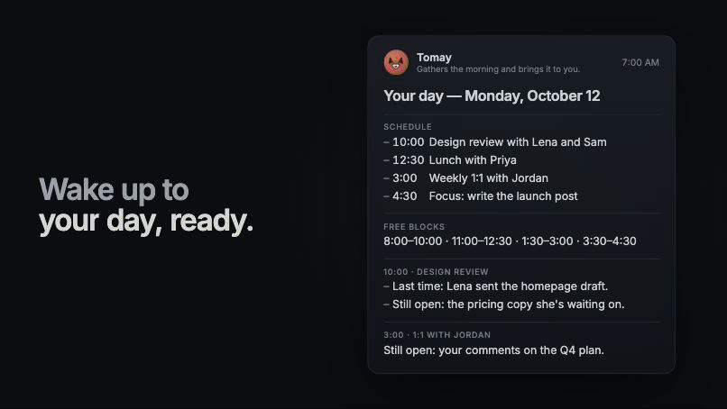
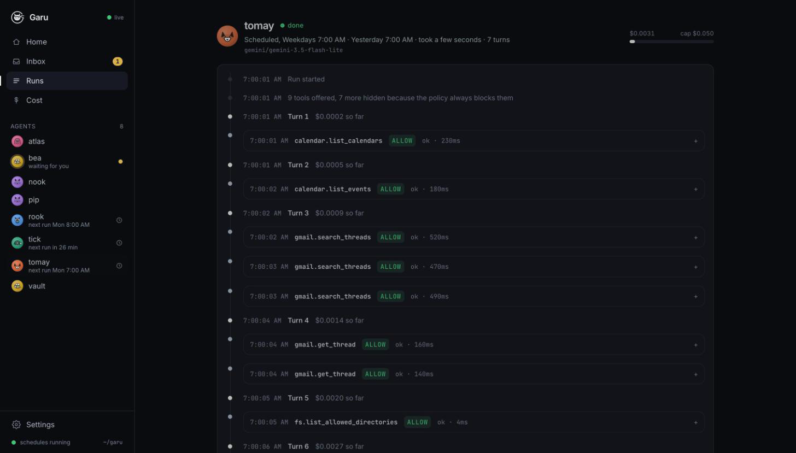
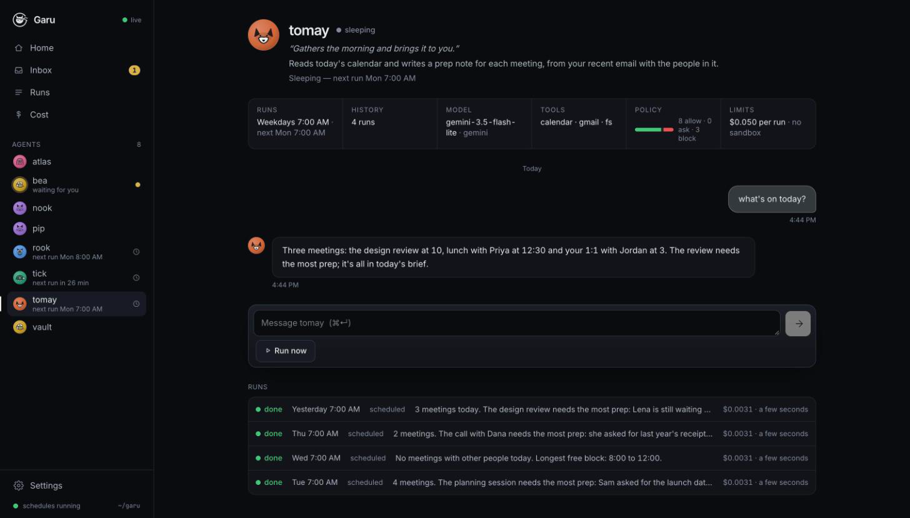
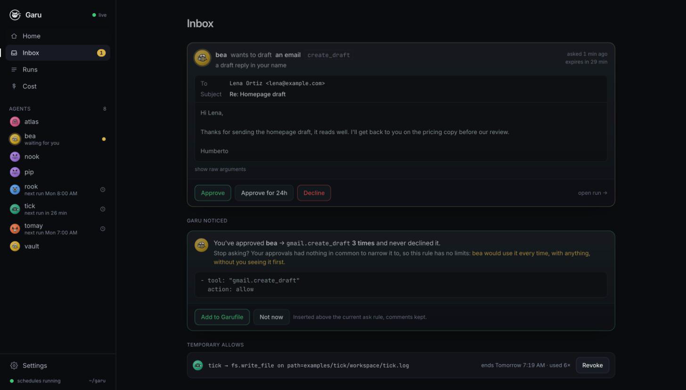

<p align="center">
  
</p>
<p align="center"><sub>From the <a href="docs/video/garu-v7-16x9.mp4">45-second launch video</a>: Bea's real rules, a draft that waits for your tap, saved and never sent. The control room's surfaces rebuilt for video; the email is an example.</sub></p>

<p align="center"></p>

<p align="center"><strong>Always-on agents you can actually trust.</strong><br>
Any model. Any MCP tool. Every action through a policy you wrote, recorded, capped, and sandboxed.</p>

<p align="center">
  <a href="https://humbertovillanueva.github.io/garu/">Website</a> ·
  <a href="docs/why.md">Why Garu</a> ·
  <a href="#try-it-in-five-minutes-free">Quickstart</a> ·
  <a href="#how-it-works">How it works</a> ·
  <a href="#the-garufile">Garufile</a> ·
  <a href="#approvals-that-get-smarter">Approvals</a> ·
  <a href="#where-garu-fits">Where Garu fits</a> ·
  <a href="#roadmap">Roadmap</a>
</p>

---

OpenAI shipped Dots and Meta shipped Muse: agents that run all day on a computer of their own and act for you. Both are closed, tied to one vendor, and unavailable in much of the world. Garu is the open version, built around the part they treat as an afterthought: **control**.

- **Agents that run 24/7.** A cron trigger in a small YAML file and `garu ui --up` keeps the agent alive. One run at a time, every fire logged, clean shutdown.
- **A policy kernel in front of every tool.** `allow`, `ask`, or `block`, by tool name *and* by argument. Tools that can never pass policy are never shown to the model.
- **An inbox, not a firehose.** When a rule says `ask`, the run pauses. You see the email as an email, the file as a file. Approve once, approve for 24 hours, or decline. Silence is a deny.
- **Policy that learns, with you in control.** Approve the same thing three times and Garu proposes the exact rule, scoped to what you actually approved, and writes it into your file when you say so.
- **A flight recorder.** Every model turn, tool call, decision and approval in an append-only log. Replay any run as a timeline.
- **A budget cap.** Cost is estimated from real token counts; a run stops the moment it would cross `maxCostUsd`.
- **A sandbox.** Each tool server in its own Docker container: no network, read-only root, only the agent's workspace mounted, destroyed after the run.
- **Any model.** Gemini (free tier), Claude, or local models through Ollama at $0. Switch by changing one line.
- **Talk to your agents.** Each agent has a thread. Ask it a question, give it work, or just read what it did while you were away.

## Try it in five minutes (free)

You need Node 22+ and a free Gemini key from [aistudio.google.com](https://aistudio.google.com) (no card).

```sh
git clone https://github.com/humbertovillanueva/garu && cd garu
npm install && npm run build
printf 'GEMINI_API_KEY=your-key\nGARU_USER=YourName\n' > .env

npm run garu -- ui --up --as YourName       # control room at http://localhost:4000
```

Open the control room, click **pip** in the sidebar, and press **Run now**. It reads `examples/pip/workspace/notes.md`, pauses to ask before writing a summary, and you approve from the browser. Then type a message to it.

Prefer the terminal?

```sh
npm run garu -- validate examples/pip/Garufile.yaml
npm run garu -- run      examples/pip/Garufile.yaml   # approve the write when asked
npm run garu -- log      pip                          # replay the flight recorder
```

**Fully local, $0:** install [Ollama](https://ollama.com), `ollama pull qwen3:8b`, then `npm run garu -- run examples/nook/Garufile.yaml`.

**Your own agent:** `npm run garu -- new` asks what it should do, when, which model, which folder and which hosts, and writes `agents/<name>/Garufile.yaml` with a policy that starts closed — only the tools you named, writes ask first, everything else blocked. Then **Run now** in the control room.

**Sandboxed:** with Docker running, `npm run garu -- sandbox build` once, then `npm run garu -- run examples/vault/Garufile.yaml`.

**Your day and your inbox:** the two agents in `agents/` work on Gmail and Google Calendar. Tomay reads your calendar every weekday at 7 and writes a prep note for each meeting; Bea files the last day's mail under four labels at 7:15 and drafts replies that wait for you. They need a free Google Cloud project once: [docs/google.md](docs/google.md) walks through it in about fifteen minutes.

## How it works

```
 you ──▶ control room / CLI ──▶ agent loop ──▶ model (Gemini · Claude · Ollama)
                                     │
                                     ▼
                              policy kernel  ──▶ allow ─▶ MCP tool server (optionally in Docker)
                                     │           ask   ─▶ inbox ─▶ you (browser · CLI · phone push)
                                     │           block ─▶ never executed
                                     ▼
                              flight recorder (.garu/runs/<agent>/<run>.jsonl)
```

An agent only ever touches the world through the [Model Context Protocol](https://modelcontextprotocol.io). The policy kernel sits between the model and every MCP server. The flight recorder sees everything the kernel sees. The control room is a view over those files; so is `garu log`. There is no database.

<p align="center"></p>

## The Garufile

One file describes an agent: who it is, what it may touch, when it wakes up, and how much it may spend. This is a real one from this repo, a little trimmed: the agent that sorts the author's inbox every weekday morning.

```yaml
name: bea
description: Sorts what arrived overnight into four labels and drafts replies to what needs one. Never sends.
persona: { kind: bee, tagline: "Sorts the inbox so you don't have to." }
model: gemini/gemini-3.5-flash-lite

triggers:
  - cron: "15 7 * * 1-5"          # weekdays at 7:15, in your local time

budget:
  maxCostUsd: 0.05                # per run; the run stops if it would cross this

tools:
  - name: gmail                   # Garu's own Gmail server: no send or delete tool exists
    command: node
    args: ["packages/mcp-google/dist/index.js", "gmail"]
    auth: oauth                   # Garu signs in once (garu auth) and hands it a one-hour token
    oauth:
      issuer: https://accounts.google.com
      clientId: ${GOOGLE_CLIENT_ID}
      clientSecret: ${GOOGLE_CLIENT_SECRET}
      scopes: [https://www.googleapis.com/auth/gmail.modify]
      authorizationParams: { access_type: offline, prompt: consent }

policy:
  - tool: "gmail.search_threads"  # reading: always fine
    action: allow
  - tool: "gmail.get_thread"
    action: allow
  - tool: "gmail.label_thread"    # filing: a label comes off in one click, so it doesn't wait
    action: allow
  - tool: "gmail.create_draft"    # a draft is words in your name: you see each one first
    action: ask
    reason: a draft reply in your name
  - tool: "*"
    action: block

prompt: |
  You are Bea. Sort Humberto's inbox from the last day…
```

Its partner, [Tomay](agents/tomay/Garufile.yaml), only reads: calendar and mail are allowed read tools, its one write is today's brief in its own folder (`fs.write_file` with `when: { path: { matches: "briefs/\\d{4}-\\d{2}-\\d{2}\\.md$" } }`), and everything else is blocked, so it never pauses at all.

Rules are evaluated top to bottom; the first match wins; nothing matching means `ask`, never a silent allow. `when` predicates (`eq`, `matches`, `gt`, `in`, …) let you allow a tool for one path or one host and block it everywhere else. `garu validate` lints the file and tells you which rules are unreachable.

Other fields: `sandbox:` (image, network, workspace, memory, cpus), `modelOptions:` (provider knobs, e.g. Ollama `think: false`), `maxTurns:`.

### Remote tool servers

A tool server can be a URL instead of a command. Garu speaks MCP's Streamable HTTP transport, so any hosted server works: GitHub's, Linear's, Notion's, your own. API keys come from `.env`; servers that want a login use OAuth, which you do once in a browser with `garu auth`.

```yaml
tools:
  - name: github
    url: https://api.githubcopilot.com/mcp/
    headers: { Authorization: "Bearer ${GITHUB_TOKEN}" }   # a fine-grained PAT, kept in .env
  - name: linear
    url: https://mcp.linear.app/mcp
    auth: oauth                                             # garu auth agents/x/Garufile.yaml linear

policy:
  - tool: "github.get_me"
    action: allow
  - tool: "github.get_file_contents"
    action: allow
  - tool: "github.create_issue"
    action: ask
  - tool: "*"
    action: block        # GitHub's server offers 46 tools; the model only ever sees these three
```

Some servers don't hand out an OAuth client of their own; Google's Workspace MCP servers (in a developer preview for now) want yours, from a Google Cloud project. Name it under `oauth:`, with the id and secret in `.env`, the exact scopes to ask for (otherwise a server may offer, and you may grant, far more than the agent needs), and any extra sign-in parameters:

```yaml
  - name: calendar
    url: https://calendarmcp.googleapis.com/mcp/v1
    auth: oauth
    oauth:
      clientId: ${GOOGLE_CLIENT_ID}
      clientSecret: ${GOOGLE_CLIENT_SECRET}
      scopes: [https://www.googleapis.com/auth/calendar.events.readonly]
      authorizationParams: { access_type: offline, prompt: consent }   # so runs can refresh without you
```

Tokens live in `.garu/auth/` (gitignored), one file per server URL, refreshed automatically; an unattended run that would need a browser stops with the exact `garu auth` command to run instead. Remote servers run on someone else's machine, so the sandbox block doesn't apply to them — the policy is the whole boundary, which is why `block` by default matters.

### Signing in for a local server

A local server can sign in too: give it `auth: oauth` and an `oauth:` block that names who to sign in with (`issuer:`), as Bea's Gmail server does above. `garu auth` does the sign-in once; Garu keeps the tokens and starts the server with a one-hour access token in its environment, so the server never holds the client secret or the refresh token. Local sign-ins are filed by issuer and permissions, so an agent that asks for read-only Gmail never shares a token with one that can write.

<p align="center"></p>

## Approvals that get smarter

The complaint practitioners make about always-on agents is that *their* throughput becomes the bottleneck: the agent works all night and you spend the morning clicking Approve. Garu treats approval as the product, not a dialog box.

1. **`ask` pauses the run** and the request appears in the inbox as what it is: an email with To/Subject/Body, a file with its path and content, a command. The agent is told it's waiting; nothing else happens.
2. **Approve · Approve for 24h · Decline.** "For 24h" creates a *grant*: this agent, this tool, this exact path/url/recipient, until tomorrow. Later identical asks are answered by the grant and logged as `approved by grant …`. `garu grants` lists and revokes them. **Decline can carry a note** ("wrong repo — use humbertovillanueva/garu"): the agent reads it before its next step, so a decline corrects the run instead of just stopping one call. Same from the terminal: `garu deny <id> --note "…"`.
3. **Learned rules.** Approve the same agent + tool three times with no declines and Garu proposes the narrowest rule that covers your approvals: one exact value, a common directory, or the whole tool. **Add to Garufile** inserts it above the current `ask` rule and keeps your comments. **Not now** hides it.
4. **Unanswered requests expire as a deny** (30 minutes by default). Silence never means yes.
5. **Phone:** `--notify https://ntfy.sh/<your-topic>` pushes each request to the free [ntfy](https://ntfy.sh) app.

<p align="center"></p>

## Commands

| Command | What it does |
|---|---|
| `garu new [name]` | Make your own agent: a few questions, then a Garufile with a closed policy. Flags for scripting (`--task`, `--when`, `--web`, `--fs`, `-y`). |
| `garu ui [--up] [--as Name] [--notify URL]` | Control room at localhost:4000. `--up` also runs every cron schedule found under the current folder. |
| `garu service install` · `status` · `logs` · `restart` · `uninstall` | Run `garu ui --up` for this folder as a login service (launchd on macOS, systemd on Linux), so a reboot doesn't take your agents down. A schedule missed while the machine was asleep or off is run once when it comes back. `restart` after a build or a schedule change. |
| `garu run <Garufile> [-i note]` | Run an agent once, approving in the terminal. |
| `garu up <Garufiles…>` | Run schedules without the UI; `--on-ask inbox\|deny\|allow\|terminal`. |
| `garu inbox` · `garu approve <id> [--for 24h]` · `garu deny <id>` | The inbox from the terminal. |
| `garu grants [list\|revoke <id>]` | Temporary allows. |
| `garu log [agent] [run]` | Replay a flight recorder. |
| `garu validate <Garufile>` | Lint policy, cron, budget, sandbox. |
| `garu auth <Garufile> <server>` | Sign in to a remote tool server once, in your browser. `--forget` removes it. |
| `garu sandbox build` | Build the default Docker image for tool servers. |

## Where Garu fits

Be clear about what this is and isn't. Dots and Muse are polished consumer products with thousands of integrations, running on their makers' clouds with their makers' models. OpenDots is a friendly open-source coworker that lives in Slack and voice calls. open-multi-agent is a serious framework for orchestrating teams of agents inside a company, with audit trails to match.

Garu is the layer underneath all of that: *systemd for your agents*. It runs on your laptop or your server, with any model including local ones, and its whole design is about one question: **can I let this thing run unattended with write access to something I care about?** Per-argument policy, rules learned from your own approvals, a cost cap on every run, a sandbox with the network off by default, and a flight recorder that misses nothing. If that's the question you're asking, this is the runtime for it.

## Status and roadmap

Garu is a week old and already runs the author's own agents every day. Expect sharp edges. What's next, in order:

1. **`garu install <url>`**: a registry of Garufiles you can install, fork and publish.
2. **Hosted Garu:** agents that keep running when your laptop is closed, tap-to-approve from anywhere, EU-friendly by default.
3. Delegation between agents over A2A; transparent, editable memory.

Done since the first commit: Gmail and Google Calendar through Garu's own server, with sign-in for local servers; remote MCP servers (Streamable HTTP + OAuth), the phone app over Tailscale with a sign-in token ([docs/phone.md](docs/phone.md)), a native Android app that pairs by scanning a code ([docs/android.md](docs/android.md)), `garu new`, personas, decline-with-a-note.

## Layout

```
packages/kernel     Garufile schema · policy engine · flight recorder · MCP bus · agent loop · scheduler · inbox · grants · suggestions · sandbox · providers
packages/cli        the garu command
packages/ui         the control room (Svelte 5 + Tailwind 4)
packages/app        the control room as a native Android app (Capacitor), pairs with a running garu ui
packages/mcp-fetch  a tiny MCP server: fetch_json / fetch_text, GET only
packages/mcp-google Gmail and Calendar MCP server: read, label, draft; no send, no delete
agents/             real agents that run from this repo (tomay, bea, rook, atlas)
examples/           Garufiles to learn from
docker/sandbox      the default sandbox image
```

## Contributing

Issues and PRs welcome. Run `npm run typecheck && npm test` before opening one. The flight recorder format and the Garufile schema are the two things we try not to break.

## License

Apache-2.0. Built by [Humberto Villanueva](https://humbertovillanueva.dev) in Salt Lake City.
